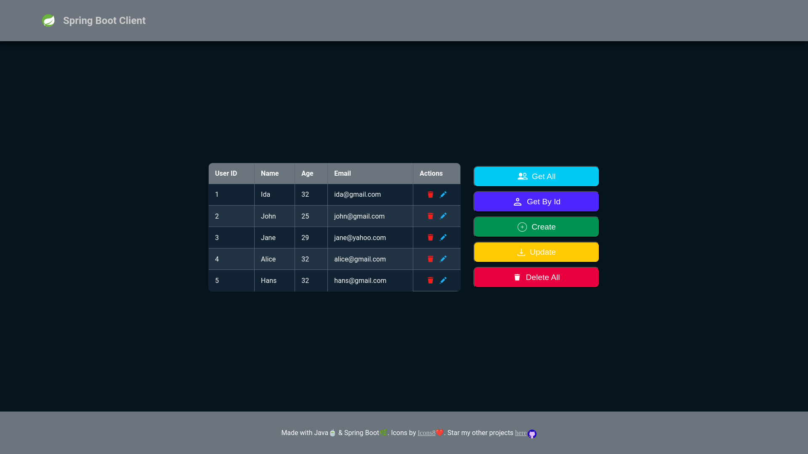

    updated on: 19th September 2024, Thursday

<div align=center>
    <a href="https://warmachine028.github.io/springboot-server/client">
        
    </a>
    <p style="font-family: roboto, calibri; font-size:12pt; font-style:italic"> A Java  demo project for Spring Boot </p>
    <a src="https://github.com/warmachine028/springboot-server/forks">
        
    </a>
</div>

# [Springboot Server](https://warmachine028.github.io/springboot-server/client)

![line]

## Table of Contents

- [Introduction](#introduction)
- [Developement](#developement)
- [Tech Stack Used](#tech-stack-used)
- [Preview](#preview)
- [Best Contributors](#best-contributors)
- [License](#license)

![line]

## Introduction

- REST API server to learn HTTP request-response in Java

![line]

## Developement

```sh
$> cd server  
$> ./mvnw --version  
$> ./mvnw clean install 
```

![line]

## Tech Stack Used

- Bakcend Framework: SpringBoot
- Backend Language: Java
- Packaging: Apache Maven
- Containerisation: Docker
- Backend Hosting: Render
- Structure: HTML
- Logic: JavaScript
- Styling: CSS
- Frontend Hosting: Github Pages

        

![line]

## Preview



![line]

## Best Contributors

<div align="center">
    <a  href="https://github.com/warmachine028/springboot-server/graphs/contributors">
        
    </a>
</div>

![line]

## License

- See [LICENSE]

**Pritam, 2024**

![line]

## Thank you, everyone 💚

[line]: https://user-images.githubusercontent.com/75939390/137615281-3a875960-92cc-407f-97fe-fd2319bdb252.png

[License]: https://github.com/warmachine028/springboot-server/blob/main/LICENSE
<!-- 19/09/24 -->
